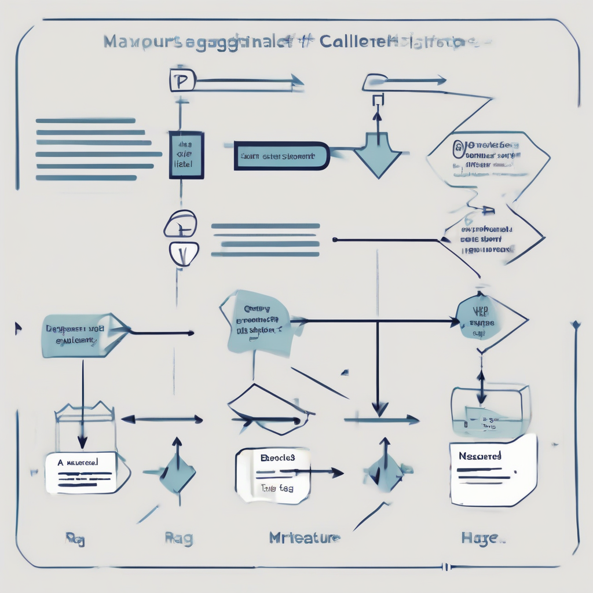

# Notes on LLM Evaluation: A Practitioner's Field Guide

## Why LLM Evaluation Is Different (and Harder)

If you come from classic ML, you carry a set of eval instincts that quietly betray you here. In supervised learning a prediction is right or wrong against a labeled target, and accuracy, F1, or AUC summarize the gap. Generative systems don't play by those rules, and pretending they do is how teams ship features that pass their metrics and fail their users.

Start with the outputs. A summary, a rewrite, an answer — there is no single ground-truth string to match against. Two responses can be worded completely differently and both be excellent, or share most of their tokens and have one be subtly wrong. Exact-match and token-overlap scores don't fail loudly here; they mislead quietly, rewarding surface similarity while missing whether the answer is actually correct, grounded, or safe.

Then there's non-determinism. The same prompt yields different outputs across temperature settings, retries, and provider-side changes. Run your suite twice and the numbers move. A single benchmark run tells you almost nothing about variance — you have to think in distributions, not point estimates.

That feeds the harder problem: the model underneath you is a moving target. Providers update weights, routing, and defaults on their own schedule, and behavior shifts without a version bump you control. A prompt that was reliable last quarter can degrade silently, and you won't notice unless you're measuring continuously.

> **INSERT CURRENT EXAMPLE — needs source:** a documented case of a provider update silently shifting model behavior.

All of this forces a reframe. "Good" is not a property of the model; it's a property of your use case. The right bar for a coding assistant, a medical triage tool, and a marketing-copy generator are not the same metric — they're different product decisions about what failure you can tolerate.

So treat evals the way you treat tests. Not a one-off leaderboard run you screenshot and forget, but a regression suite that guards behavior on every change — prompt, model, or dependency.

## A Taxonomy of Eval Methods

Every eval you'll run falls into one of a few families. Knowing them by name — and knowing what each one costs — is the difference between measuring your system and flattering it.

**Reference-based metrics** compare output against a gold answer. Exact match and token F1 for extractive tasks; BLEU and ROUGE for translation and summarization; embedding similarity when you want to reward paraphrases. They're cheap, deterministic, and reproducible — you can run them a million times in CI for free. They're also brittle: they punish correct answers that don't match the reference and reward fluent nonsense that does. Reach for them when the output space is narrow and a trusted reference set exists. Distrust them the moment the task admits many valid phrasings.

**Human evaluation** is the gold standard for quality and preference — the thing every other method is trying to approximate. Pay people to rate or rank outputs and you get signal no automated metric can fake. The catch is cost and latency: it's slow, expensive, and only as good as your process. Without a written rubric and a check on inter-rater agreement, you aren't measuring quality, you're measuring mood. Spend it on the decisions that matter: launch gates, model comparisons, and calibrating your cheaper methods.

**LLM-as-judge** uses a strong model to score or compare outputs. It's the workhorse of modern eval because it scales human-like judgment to thousands of examples for the price of inference. But it's a biased instrument — sensitive to position, length, verbosity, and self-preference. Treat it like a lab sensor: calibrate it against human labels, pin the judge model and prompt, and report agreement, not just scores.

**Programmatic / rule-based checks** are assertions, not judgments. Does the JSON parse? Does the schema validate? Does the output avoid a banned pattern? These are cheap, fast, and unambiguous — ideal for structured outputs and safety-critical guardrails where "close enough" is a bug. They can't tell you whether an answer is *good*, only whether it's *well-formed* or *unsafe*.

Cutting across all four is **altitude**. Component-level evals test one piece — a retriever, a classifier — in isolation. Task-level evals ask whether the model does the job on a given prompt. End-to-end evals test the whole pipeline as users experience it. Pick the altitude that matches your question: a great retriever behind a broken prompt still ships a broken feature.


*The four eval method families crossed with evaluation altitude — pick the cell that matches your question.*

**When each earns its cost:**

| Method | Reach for it when… |
|---|---|
| Reference metrics | Narrow output, trusted references, high-frequency CI |
| Programmatic checks | Structured or safety-critical outputs |
| LLM-as-judge | Open-ended quality at scale, calibrated against humans |
| Human eval | Launch gates, ground truth, and calibrating the rest |

## Building an Eval Dataset You Can Trust

Your eval is only as good as the data underneath it. A pile of hand-written happy-path prompts will tell you your feature works — right up until it doesn't. Start somewhere real.

**Start from real traffic and real failures.** The best examples already exist: in your logs, your support tickets, your thumbs-down feedback. Mine production for the inputs users actually send and the places your system actually broke. Synthetic examples help fill gaps, but a dataset built entirely from imagined inputs measures your imagination, not your product.

**Prioritize coverage over volume.** Two hundred well-chosen examples beat ten thousand near-duplicates. Stratify deliberately: by intent (what the user wants), by difficulty (trivial to adversarial), by edge case (empty inputs, wrong language, injection attempts), and by known failure mode. Every time you find a new way to fail, add a row. A small set that spans your real distribution beats a giant one that clusters around the easy middle.

**Treat labels as a first-class problem.** Vague instructions produce noisy labels, and noisy labels hide real regressions. Write a rubric precise enough that two people apply it the same way — then verify that assumption by measuring inter-annotator agreement. When it's low, fix the rubric before you touch the model. Don't paper over disagreements by averaging; adjudicate them, because the hard cases are usually where "correct" is genuinely unsettled.

**Assume public benchmarks are contaminated.** If a benchmark is on the internet, assume it's in the training data. A high score may mean the model memorized the answers, not that it can reason. Public benchmarks are fine for rough triage, but your trustworthy signal comes from private data the model has never seen.

> **INSERT CURRENT EXAMPLE — needs source:** a recent, documented benchmark-contamination finding, to make this concrete.

**Version the dataset like code.** Put it in source control, freeze it, and change it only through reviewed commits. If the set shifts silently, yesterday's 82% and today's 85% aren't comparable and your whole history turns to noise. Tag releases so any past number stays reproducible.

**Keep three sets with three jobs.** A *golden set* is small, frozen, and hand-verified — your source of truth. A *regression set* is the growing archive of past bugs you never want to reintroduce. An *exploratory set* is scratch space for probing new behaviors before you trust them. Don't let them blur; each one demands its own discipline.

## LLM-as-Judge: Making It Actually Reliable

An LLM judge is the fastest way to scale evaluation — and the fastest way to fool yourself. Treat its scores as a measurement instrument that must be calibrated before you trust a single number.

**Know the biases.** Four show up constantly. *Position bias*: the judge favors whichever candidate appears first (sometimes last), independent of quality. *Verbosity bias*: longer, more elaborate answers score higher even when the padding adds nothing. *Self-preference*: a model tends to reward outputs that resemble its own style — a real problem when the judge and the system-under-test (SUT) share a family. *Formatting sensitivity*: bullet points, bold text, and a confident tone nudge scores regardless of substance.

**Mitigate structurally, not by pleading.** Don't ask the prompt to "be unbiased." *Randomize order* — better, score both orderings and keep the verdict only when it's consistent; the flip rate is a free diagnostic. Prefer *pairwise comparison* ("which is better, A or B?") over absolute 1–10 ratings; models are far more reliable at relative judgments. *Force rubric-anchored reasoning*: require the judge to quote the specific criterion and justify against it before emitting a verdict. And *calibrate thresholds* on real data rather than assuming 7/10 means "ship it."

**Validate against humans before scaling.** This is non-negotiable. Collect a few hundred human labels, run the judge on the same items, and measure agreement (rank correlation, or Cohen's/Krippendorff's for categorical calls). If the judge doesn't track people on a sample you can afford to label, it will not magically track them on the millions you can't. Low agreement means the judge is measuring something — just not what you named.

**Design the prompt like a spec.** State *explicit criteria* — define "good" concretely, no vibes. Provide *few-shot anchors*, especially borderline and negative examples, so the scale is grounded. Demand *structured output* (JSON with a score plus a reason field) so results are parseable and auditable instead of free text you have to re-interpret.

**Know when to walk away.** Don't use a judge for *safety-critical scoring* where a false pass carries real cost — use humans or deterministic checks. Don't use it where *numeric precision* matters (exact counting, arithmetic, unit correctness); judges approximate. And be most suspicious when the *judge shares the SUT's blind spots*: same model family, same training data, same failure modes means correlated errors and false confidence — the judge waves through exactly the mistakes you most need to catch.

> **INSERT CURRENT EXAMPLE — needs source.** Cite a recent judge-reliability study or evaluation framework quantifying these biases (position/verbosity/self-preference) and typical human-agreement rates. None available in the provided evidence set; author must supply.

## Metrics That Match the Task

The fastest way to ship a broken feature is to grade it with the wrong number. A single leaderboard score tells you how a model ranks on someone else's task, not whether yours works. Start by naming your task type, because each one needs a different lens.

**Classification** wants precision, recall, and per-class F1 — accuracy alone hides minority-class failures. **Free-form generation** rarely has one right answer, so lean on reference-free judgments, pairwise preference, or rubric scoring rather than string overlap. **Retrieval/RAG** splits into a retrieval stage and a generation stage; measure them separately or you can't tell which half is failing. **Agentic multi-step** work is judged on outcomes across a trajectory, not any single turn. And **tool use** needs correctness at the call boundary: did the model pick the right tool with the right arguments?

For RAG, four signals earn their keep. **Faithfulness/groundedness** asks whether the answer is supported by retrieved context — the direct counter to hallucination. **Context relevance** grades the retriever: did it fetch the right passages? **Answer relevance** checks that the response actually addresses the question. **Citation correctness** verifies that quoted sources say what the answer claims. A confident, well-cited, and wrong answer is exactly the failure these catch.


*Where each RAG eval signal attaches: context relevance grades the retriever, faithfulness and citation correctness grade grounding, answer relevance grades the final response.*

For agents, track **task success rate** (did it finish the job?), **step efficiency** (how many actions, and how many wasted?), **tool-call correctness** (right tool, right arguments, right order), and **recovery from errors** — an agent that hits a failed call and self-corrects beats a brittle one that got lucky on the happy path.

Quality is not the whole scorecard. **Latency**, **cost-per-task**, and **token efficiency** are first-class eval metrics, not afterthoughts. A system that's marginally "better" on quality but several times slower and more expensive usually loses in production. Measure these in the same harness as everything else.

Aggregate honestly. A single mean flatters you and hides the tail. Report **distributions** (p50, p90, p99) and **slice** by segment — language, document type, user cohort. Watch for **Simpson's paradox**: an overall average can improve while every subgroup gets worse. If you only ever look at one number, you will eventually ship a regression that number cannot see.

Finally, separate **guardrail metrics** from **optimization metrics**. Optimization metrics are what you push on; guardrails — safety, latency ceilings, cost caps — are floors you are not allowed to trade away. Write down which is which *before* you tune, or you'll "win" by quietly breaking a constraint that mattered.

> **INSERT CURRENT EXAMPLE — needs source:** a current RAG/agent eval harness that reports these signals out of the box.

## From Notebook to Pipeline: Operationalizing Evals

An eval that lives in a notebook protects nothing. The moment it matters is when a prompt tweak, a model swap, or a provider-side update quietly degrades quality — and the only way to catch that is to make evals part of the machinery that ships your code.

**Wire evals in as CI gates.** Treat your regression set like a test suite: run it on every prompt or model change, and fail the build when scores drop below an agreed threshold. Don't gate on a vibe — gate on a number tied to a baseline you've committed to the repo. Give the threshold enough margin that ordinary run-to-run noise doesn't make the gate flaky, or people will just learn to override it.

```python
# test_eval_gate.py — runs in CI
BASELINE = 0.82  # your committed baseline, versioned with the eval set

def test_no_regression():
    scores = run_eval_suite("regression_set.jsonl")
    mean = sum(scores) / len(scores)
    assert mean >= BASELINE, f"Quality regression: {mean:.3f} < {BASELINE}"
```

**Separate offline from online.** Offline (pre-deploy) suites answer "is this change safe to ship?" against a curated, versioned dataset. Online eval answers "is it still working in production?" by sampling live traffic and scoring a slice of real requests. You need both: offline catches regressions before users do; online catches the distribution shifts your fixture set never anticipated.

**Handle non-determinism head-on.** LLM outputs vary run to run. Pin what you can — temperature to 0, fixed seeds where the provider supports them — but accept that some variance is irreducible. Run N samples per case and track the distribution, not a single point score. A mean that looks fine can hide a fat tail of failures; report variance and worst-case, not just the average.

**Track trends over time.** A single passing build tells you little. Push scores to a dashboard, break them out per slice (locale, input length, user segment), and watch the lines. The failure mode that bites hardest is silent drift: a provider updates the model behind an unchanged API and your quality moves without a single line of your code changing. Alert on it.

**Keep a human in the loop.** Automated scoring is a filter, not a verdict. Route low-confidence, flagged, or high-stakes outputs to a review queue where a person makes the call. Feed those judgments back into your eval set so today's edge case becomes tomorrow's regression test.

> **INSERT CURRENT TOOLING EXAMPLE — needs source.** Name a current eval/observability framework here (dataset versioning + CI integration + production tracing). No specific product is cited because the evidence set is empty; supply a source before naming one.

The principle outlasts the tooling: evals belong in the pipeline, not the notebook — running before every deploy and continuously after.

## Common Failure Modes and Anti-Patterns

These are the mistakes that make your dashboard glow green while users quietly churn. Learn to smell them.

**Optimizing the metric, not the outcome.** The moment a number becomes a target, someone starts gaming it — Goodhart's law, right on schedule. You tune prompts until the eval passes, then ship a feature that's worse in every way the eval doesn't measure. The score is a proxy; the product is the point. When they diverge, trust the product.

**Eval sets too small to mean anything.** Fifty hand-picked examples produce a number with a confidence interval wide enough to drive a truck through. A jump from 82% to 86% on 50 cases is noise wearing a suit. If you can't state the margin of error, you don't have a result — you have a vibe.

**Reporting one run as if it were stable.** LLMs are stochastic, and graders often are too. Run the same eval three times and watch the "winner" flip. Report a single number and you're reporting a coin toss. Run it repeatedly, show the spread, and decide on the distribution — not the lucky draw.

**Trusting an unvalidated judge.** LLM-as-judge is seductive and frequently fine — but only after you've checked it against human labels. Skip that step and you inherit its biases wholesale: position bias, length bias, a soft spot for its own family's phrasing. An unaudited judge doesn't measure quality; it launders your assumptions into a percentage.

**Contamination and staleness.** If your eval leaked into training, you're grading an open-book exam and calling it mastery. And even a clean set rots: traffic shifts, users ask new things, and last quarter's eval stops resembling production. Refresh from real logs, and re-verify that public benchmarks haven't simply been memorized. *(INSERT CURRENT EXAMPLE — recent documented benchmark-contamination case; needs source.)*

**Averages that hide the tail.** A mean of 4.2/5 feels great and tells you nothing about the 3% of responses that leak PII, invent a refund policy, or insult a customer. Users remember the catastrophe, not the average. Watch p95, worst-case slices, and raw failure counts — the tail is where trust dies.

The through-line: every one of these makes the *number* look better than the *product*. Evaluate the product.

## A Starter Playbook and Checklist

If you take nothing else from this guide, take the sequence. Most eval efforts fail not because the metrics are wrong but because they're built in the wrong order — tooling first, question last.

**Step 1 — Name the decision.** Before you measure anything, write down the decision the eval exists to inform: ship or hold, model A or B, prompt v3 or v4. A metric that can't change a decision is a vanity metric. Work backward from the decision to the smallest set of numbers that would actually move it.

**Step 2 — Build a golden set from real failures.** Don't synthesize a pristine benchmark. Mine your logs, support tickets, and bug reports for cases you actually got wrong, curate 50–200 of them, and write down the expected behavior. Then version it — a golden set that silently mutates is worse than none, because your trend lines lie.

**Step 3 — Use the cheapest method that answers the question.** Exact-match and assertions before model judges; model judges before humans. Humans are your gold standard and your scarcest resource; spend them on calibration and hard cases, not bulk grading.

**Step 4 — Validate the judge before you trust it.** If you use an LLM judge, prove it agrees with humans on a labeled sample, lock the rubric, and freeze the judge's version. An unvalidated judge is just a confident random number generator. *(INSERT CURRENT EXAMPLE — needs source: recommended judge model / agreement threshold.)*

**Step 5 — Automate and sample.** Wire the regression set into CI so every change is scored before merge, and add production sampling so reality — not your test set — gets the last word.

**Copy-paste checklist:**

```
[ ] Decision this eval informs is written down
[ ] Golden set built from real failures (50–200), versioned
[ ] Cheapest viable method chosen; humans reserved for calibration
[ ] Judge validated vs. humans; rubric + judge version frozen
[ ] Regression set runs in CI on every change
[ ] Production traffic sampled and reviewed on a schedule
[ ] Owner assigned; cadence for refreshing the set
```
